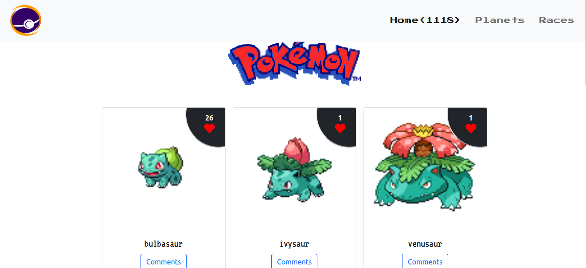
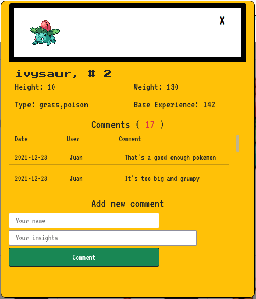

# My Pokémons

> **Gotta Catch ’Em All!** With this web app, you can discover all the Pokémon around the Pokémon World, from Kanto to Lental. Gotta check 'em all. Give a like (or many :two_hearts:) to your favorite Pokémons and share with the world what do you like more of them!

### What can you do on this web app?

This web app allows users to give likes and comments to their favorite Pokémons. When a user clicks on the comment section, a modal popup opens retrieving basic info of a Pokémon (size, type, and base experience). Users can see all the comments given to that Pokémon and they can leave new comments.

## Built With

- HTML 5
- CSS
- JavaScript
- Webpack
- VS Code
- Gitflow
- PokéApi
- InvolvementAPI

## Live Demo

[Live Demo Link](https://livedemo.com)

## Getting Started

**This is an example of how you may give instructions on setting up your project locally.**
**Modify this file to match your project, remove sections that don't apply. For example: delete the testing section if the currect project doesn't require testing.**

To get a local copy up and running follow these simple example steps.

### Prerequisites

### Setup

### Install

### Usage

### Run tests

### Deployment

## Authors

👤 **Shady Shawkat**

- GitHub: [@ShadyShawkat](https://github.com/ShadyShawkat)
- Twitter: [@ShadyShawkat3](https://twitter.com/ShadyShawkat3)
- LinkedIn: [Shady Shawkat](https://linkedin.com/in/Shady-Shawkat)

👤 **J. P. Pérez-Tejada**

- GitHub: [@Maclenn77](https://github.com/Maclenn77)
- Twitter: [@SrJuanPapas](https://twitter.com/SrJuanPapas)
- LinkedIn: [Juan Paulo Pérez Tejada](https://linkedin.com/in/juanpaulopereztejada)

## 🤝 Contributing

Contributions, issues, and feature requests are welcome!

Feel free to check the [issues page](https://github.com/Maclenn77/Capstone-Project-JavaScript/issues).

## Show your support

Give a ⭐️ if you like this project!

## Acknowledgments

- Hat tip to anyone whose code was used
- Inspiration
- etc

## 📝 License

This project is [MIT](./MIT.md) licensed.
